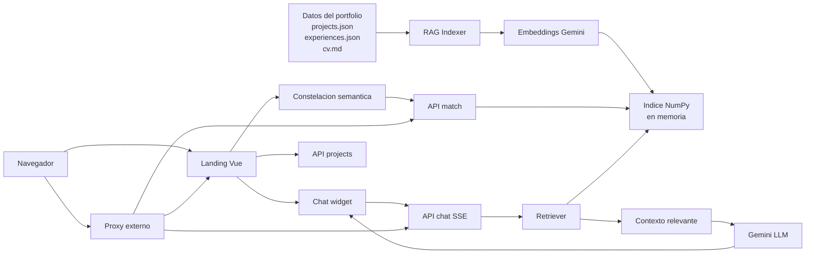
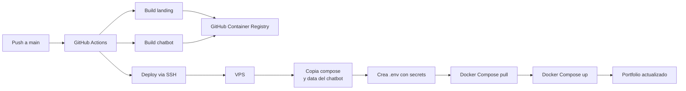

# Portfolio Core

Portfolio Core es el repositorio principal del portfolio de Fernando Canal. Contiene la landing interactiva, una constelacion semantica para explorar perfil/proyectos/experiencia y un backend FastAPI con RAG sobre datos estructurados del portfolio. El objetivo del proyecto es presentar capacidades tecnicas de AI Software Engineering con una experiencia web usable, desplegable y conectada a un asistente AI.

Este repositorio funciona como el punto de entrada del ecosistema del portfolio. Los subproyectos viven en rutas independientes, mientras que Core centraliza la pagina principal, el chatbot, la busqueda semantica y la orquestacion base para despliegue.

## Caracteristicas principales

- Landing SPA en Vue 3 con una experiencia visual tipo constelacion semantica.
- Busqueda semantica sobre nodos de portfolio: perfil, experiencia, formacion, skills y proyectos.
- Chatbot RAG con streaming SSE para responder preguntas sobre el portfolio.
- Fuente de datos controlada en JSON/Markdown dentro de `landing/backend/data/`.
- Backend FastAPI con rate limiting en memoria, sanitizacion de entradas y health check.
- Index semantico en memoria con embeddings de Gemini y similitud coseno con NumPy.
- Frontend con fallback local cuando el backend semantico no esta disponible.
- Despliegue Docker con servicios separados para landing y chatbot.
- CI/CD con GitHub Actions, GHCR y despliegue automatizado por SSH al VPS.

## Flujo general



En runtime, el backend construye el indice RAG al iniciar. La landing consulta `/v1/projects` para poblar referencias de proyectos, `/v1/constellation` para cargar nodos iniciales, `/v1/match` para reordenar la constelacion por relevancia semantica y `/v1/chat` para recibir respuestas del asistente en streaming.

## Estructura del repositorio

```text
.
|-- landing/
|   |-- frontend/              # SPA Vue 3, constelacion, chat y UI
|   `-- backend/               # FastAPI, RAG, datos del portfolio
|-- docker-compose.yml         # Orquestacion principal
|-- docker-compose.local.yml   # Proxy local opcional
|-- nginx.local.conf           # Configuracion local del proxy
|-- .env.example               # Variables de entorno esperadas
`-- .github/workflows/         # Pipeline de build y deploy
```

## Stack tecnico

| Capa | Tecnologias |
|---|---|
| Frontend | Vue 3, Vite, Tailwind CSS 4, GSAP, d3-force, tsParticles, Lenis |
| Backend | FastAPI, Uvicorn, Pydantic, python-dotenv |
| AI / RAG | Google GenAI SDK, Gemini LLM, Gemini embeddings, NumPy |
| Infraestructura | Docker, Docker Compose, Nginx, GitHub Actions, GHCR |
| Datos | JSON para nodos estructurados, Markdown para CV base |

## Componentes funcionales

### Landing interactiva

La landing vive en `landing/frontend/` y monta dos experiencias principales:

- `ConstellationHero.vue`: escena principal del portfolio con nodos interactivos.
- `ChatWidget.vue`: asistente flotante con historial en `sessionStorage` y streaming SSE.

La aplicacion carga proyectos desde el backend y filtra los que tienen estado `live`. El proyecto activo incluido actualmente es `Auto Profiling + AI Layer`, enlazado internamente hacia `/profiling/`.

### Constelacion semantica

La constelacion representa nodos del portfolio y sus relaciones. El frontend usa:

- `useConstellation.js` para cargar nodos, ejecutar busquedas y manejar estado.
- `useConstellationPhysics.js` para layout fisico con `d3-force`.
- `ConstellationNode.vue`, `ConstellationDetail.vue`, `ConstellationSearch.vue` y `ConstellationFallback.vue` para visualizacion, detalle y accesibilidad.

Cuando el usuario busca una capacidad, tecnologia o experiencia, el frontend llama a `/v1/match`. El backend genera embedding de la consulta, calcula similitud contra el indice y devuelve los nodos con score. Los nodos centrales se mantienen como anclas y no compiten en scoring.

### Chatbot RAG

El chatbot usa `/v1/chat` y recibe respuestas como Server-Sent Events:

```text
data: {"type":"token","content":"..."}
data: {"type":"done"}
data: {"type":"error","message":"..."}
```

El agente:

- Recupera contexto relevante con embeddings.
- Construye un prompt con contexto y ultimos mensajes de historial.
- Responde en el mismo idioma del usuario.
- Limita la respuesta a informacion presente en el contexto del portfolio.
- Incluye URLs cuando menciona proyectos con enlace.

## Datos del portfolio

Los datos que alimentan la landing y el RAG viven en `landing/backend/data/`:

| Archivo | Uso |
|---|---|
| `projects.json` | Proyectos desplegados o destacados, con stack, highlights, URL y conexiones |
| `experiences.json` | Nodo central de persona, experiencia, formacion y skills |
| `cv.md` | Documento base del CV y contexto profesional |

El indice actualmente se construye desde `projects.json` y `experiences.json`. Cada entrada se normaliza como nodo y se transforma en un chunk de texto optimizado para embeddings. Los nodos centrales se conservan para la visualizacion, pero se excluyen del ranking semantico.

## API principal

| Metodo | Ruta | Descripcion |
|---|---|---|
| `GET` | `/health` | Estado del backend y disponibilidad del indice RAG |
| `GET` | `/v1/projects` | Lista de proyectos desde `projects.json` |
| `GET` | `/v1/constellation` | Lista de nodos para render inicial de la constelacion |
| `POST` | `/v1/match` | Ranking semantico de nodos segun una consulta |
| `POST` | `/v1/chat` | Chatbot RAG con streaming SSE |

Ejemplo de busqueda semantica:

```bash
curl -X POST /v1/match \
  -H "Content-Type: application/json" \
  -d '{"query":"proyectos con FastAPI y RAG"}'
```

Ejemplo de chat:

```bash
curl -X POST /v1/chat \
  -H "Content-Type: application/json" \
  -d '{"message":"Que proyectos demuestran experiencia en AI Engineering?","history":[]}'
```

## Variables de entorno

El backend necesita una API key para construir embeddings y generar respuestas:

| Variable | Descripcion |
|---|---|
| `LLM_API_KEY` | API key de Gemini Developer API |
| `LLM_MODEL` | Modelo de Gemini usado para responder en el chatbot |

El archivo `.env.example` documenta los valores esperados. El archivo `.env` real no debe versionarse.

## Ejecucion con Docker Compose

Requisitos:

- Docker
- Docker Compose
- `LLM_API_KEY` configurada
- Red externa `portfolio-net` disponible

Flujo recomendado:

```bash
cp .env.example .env
docker network create portfolio-net
docker compose up --build
```

El compose principal levanta:

| Servicio | Responsabilidad |
|---|---|
| `portfolio-landing` | Landing Vue servida por Nginx |
| `portfolio-chatbot` | Backend FastAPI con RAG y chatbot |

Para un proxy local adicional existe `docker-compose.local.yml`, que monta `nginx.local.conf` y enruta hacia los servicios del portfolio.

## Desarrollo local sin Docker

### Backend

```bash
cd landing/backend
python -m venv .venv
source .venv/bin/activate
pip install -r requirements.txt
LLM_API_KEY=tu_api_key uvicorn main:app --reload
```

### Frontend

```bash
cd landing/frontend
npm install
npm run dev
```

En desarrollo, el frontend usa rutas relativas para consumir el backend. Si se ejecutan por separado, configura el proxy local o sirve ambos mediante Docker Compose para replicar el comportamiento de produccion.

## Seguridad y limites

- El backend aplica rate limiting en memoria por IP.
- `/v1/chat` limita mensajes y longitud de historial.
- `/v1/match` tiene limite independiente para busquedas semanticas.
- Las entradas se recortan antes de procesarse.
- El agente esta instruido para no inventar datos fuera del contexto recuperado.
- El streaming SSE desactiva buffering en Nginx para evitar respuestas retenidas.
- Las rutas publicas solo exponen lectura, busqueda y conversacion; los datos del portfolio se actualizan de forma interna via repositorio/despliegue.

## CI/CD y despliegue



El workflow `.github/workflows/deploy.yml` se ejecuta en pushes a `main`:

1. Construye las imagenes Docker de `landing/frontend` y `landing/backend`.
2. Publica las imagenes en GitHub Container Registry.
3. Se conecta al VPS por SSH.
4. Copia `docker-compose.yml` y los datos del chatbot.
5. Crea `.env` con `LLM_API_KEY` desde secrets.
6. Asegura la red compartida del portfolio.
7. Ejecuta `docker compose pull` y `docker compose up -d`.
8. Limpia imagenes no usadas para reducir consumo de disco.

## Tests y validacion

No hay una suite automatizada versionada para este repo. Las validaciones practicas actuales son:

```bash
cd landing/frontend
npm run build
```

```bash
cd landing/backend
python -m py_compile main.py rag/*.py
```

Para validar el backend completo se requiere `LLM_API_KEY`, porque el indice RAG genera embeddings al iniciar.

## Estado actual

El proyecto ya integra una landing interactiva, constelacion semantica, chatbot RAG con streaming, datos estructurados del portfolio, Docker Compose y despliegue continuo. Las areas naturales de evolucion son ampliar la base de proyectos, agregar tests automatizados, persistir metricas de uso del chatbot y endurecer CORS/rate limiting con configuracion especifica de produccion.
